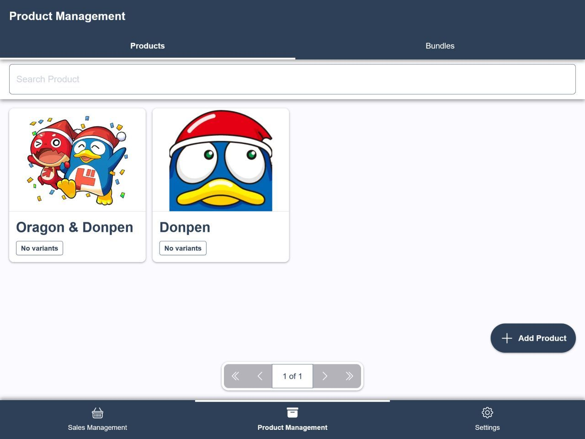

# ComPOS
ComPOS is a free simple offline-first Point of Sale (POS) that you can use to manage your day to day sales. Originally built to help my friends to help them catalogue their products and manage their sales during [Comifuro](https://comifuro.net/) (a bi-annual dōjinshi/comic event in Indonesia), but it's also suitable for any small retail business.

Key features:
1. Product variants
2. Product bundling capabilities
3. Data backup/export to JSON
4. Data restore functionality
5. All data are stored locally, no ads, and no tracking.
6. PWA

URL: [https://www.usecompos.com/](https://www.usecompos.com/)

## Screenshots


## Development
### Requirements
- Node ^22.3.0
- pnpm ^9.3.9

### Getting Started
1. Install dependencies:
   ```
   pnpm install
   ```

2. Build icons **(required for first run or when adding new icon)**:
   ```
   pnpm icons:build
   ```

3. Create the required `.env` files using provided `.env.example`
   
### Commands
```
# Run Storybook
pnpm storybook

# Run development server
pnpm dev

# Run development server with host
pnpm dev:host

# Build for production
pnpm build

# Build and preview for production
pnpm build:preview

# Build and preview for production with host
pnpm build:preview:host
```

### Adding New Icon
1. Put new svg in `./src/assets/icons`
2. After adding the new icon, run:
   ```
   pnpm icons:build
   ```

The command will run scripts to generate web-component and icon map needed that will be outputted in `.src/components/Icons`.

## Known Issues
1. **Firefox iOS Backup**
   In iOS, Firefox has different behaviour with other browsers using Chromium, where Firefox will preview JSON data rather than give option to download it when creating backup like other Chromium browser do unless you’re .

   If you’re add the application to the home screen and run it in PWA context window, it run just fine.

   Reference:
   - https://bugs.webkit.org/show_bug.cgi?id=216918#c14
   - https://bugzilla.mozilla.org/show_bug.cgi?id=1756980
   - https://github.com/mozilla-mobile/firefox-ios/issues/13299

## Credits
### Assets
- Icons used are SVG provided by [Bootstrap Icons](https://icons.getbootstrap.com/)